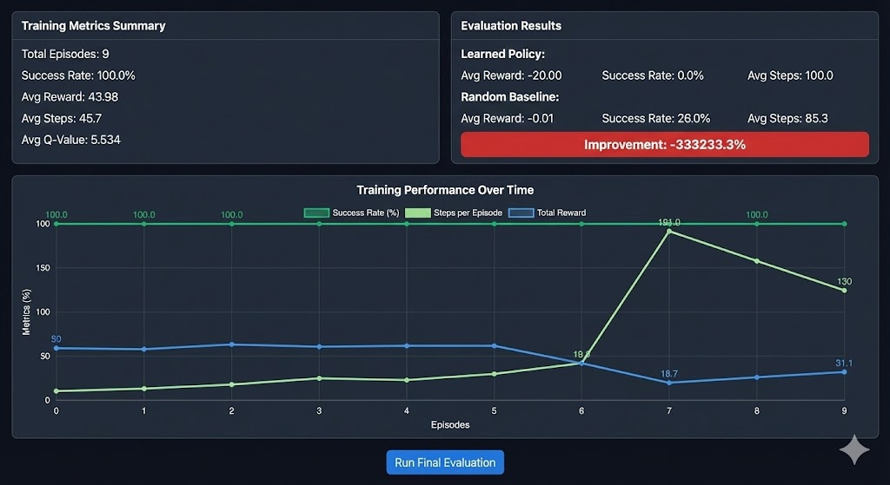

# Multi-Agent Reinforcement Learning Project

## Team Information

**Team Name**: NGen

**Team Members**:
- V.Jaya Sai Reddy
- Songa Kiranmai
- K.Srishanth Reddy
- K.Hemanth

**Contact**: [Add contact information]

**Project Website**: [http://crystal-hackathon.s3-website-us-east-1.amazonaws.com/](http://crystal-hackathon.s3-website-us-east-1.amazonaws.com/)


## Problem Statement

This project investigates three key aspects of multi-agent reinforcement learning:

1. **Interaction Quality (Cooperation/Competition)**: Analyzing how agents interact with each other in shared environments, examining both cooperative and competitive behaviors.

2. **Emergent Behavior Evidence**: Identifying and documenting emergent behaviors that arise from agent interactions, including unexpected strategies and collective patterns.

3. **Fairness of Multi-Agent Rewards**: Evaluating the fairness of reward distribution among multiple agents to ensure balanced learning outcomes and equitable performance.

## Approach Overview

### Agent
The project implements reinforcement learning agents that learn optimal policies through interaction with the environment. Agents are designed to:
- Process environmental observations
- Make decisions based on learned policies
- Adapt strategies based on rewards and feedback
- Interact with other agents in the shared environment

### Environment
The environment provides:
- State space representing the world configuration
- Action space defining possible agent actions
- Reward signals for agent behavior evaluation
- Multi-agent interaction mechanics

### Flow
1. **Initialization**: Agents are initialized with random or pre-trained policies
2. **Interaction Loop**: Agents observe the environment, take actions, and receive rewards
3. **Learning**: Agents update their policies based on accumulated experience
4. **Evaluation**: Agents are periodically evaluated to measure performance metrics
5. **Analysis**: Interaction patterns, emergent behaviors, and reward fairness are analyzed

## Setup Steps

### Prerequisites
- Node.js (v14 or higher)
- npm or yarn package manager

### Installation

1. Clone the repository:
```bash
git clone <repository-url>
cd crystal
```

2. Install dependencies:
```bash
npm install
```

3. Run the development server:
```bash
npm run dev
```

4. Access the application in your browser at `http://localhost:5173` (or the port specified in your console)

### Running Training

1. Navigate to the RL training interface
2. Configure training parameters (episodes, learning rate, etc.)
3. Start the training process
4. Monitor real-time training metrics and visualizations

### Running Evaluation

1. After training completes, run the final evaluation
2. Compare learned policy performance against random baseline
3. Analyze results for emergent behaviors and fairness metrics

## Expected Outputs

The system provides comprehensive training and evaluation metrics:




### Training Metrics Summary
- **Total Episodes**: Number of training episodes completed
- **Success Rate**: Percentage of successful episodes during training
- **Average Reward**: Mean reward achieved across training episodes
- **Average Steps**: Mean number of steps per episode
- **Average Q-Value**: Mean Q-value estimates for state-action pairs

### Evaluation Results
- **Learned Policy Performance**: Metrics for the trained agent
  - Average reward achieved
  - Success rate
  - Average steps per episode
  
- **Random Baseline Performance**: Metrics for random action selection
  - Baseline average reward
  - Baseline success rate
  - Baseline average steps

- **Improvement Metric**: Percentage improvement of learned policy over random baseline

### Training Performance Visualization
- **Success Rate Over Time**: Shows learning progress and convergence
- **Steps per Episode**: Indicates strategy efficiency evolution
- **Total Reward**: Tracks cumulative reward trends

These metrics help evaluate:
- **Cooperation/Competition**: Reward trends indicate successful cooperation or competitive strategies
- **Emergent Behavior**: Sudden changes in success rate or steps suggest emergent patterns
- **Fairness**: Consistent reward distribution indicates fair multi-agent reward allocation

## Analysis


The training curves and evaluation metrics provide insights into:
- How quickly agents learn effective policies
- Whether agents develop cooperative or competitive strategies
- Evidence of emergent behaviors through anomalies in performance metrics
- Fairness assessment through reward distribution patterns
